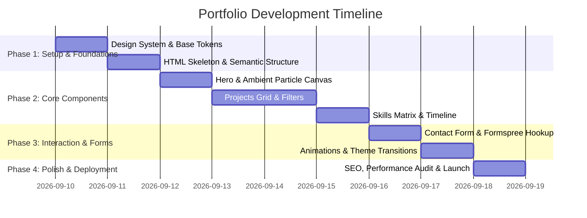

# Product Requirements Document (PRD)

## Project Overview
**Product Name:** Modern Developer & Engineering Portfolio  
**Target Audience:** Tech Recruiters, Engineering Managers, Potential Clients, Open-Source Collaborators, and Peer Developers.  
**Objective:** A high-performance, visually engaging, modern portfolio website showcasing software engineering excellence, featured projects, deep technical skillsets, and professional milestones with interactive elements and refined aesthetics.

---

## 1. Goals & Value Proposition
* **Brand & First Impression:** Deliver an immediate "wow" factor through modern glassmorphism, responsive ambient/particle visuals, sleek dark-mode aesthetics, and smooth micro-interactions.
* **Showcase Capabilities:** Clearly illustrate technical expertise, architectural depth, and real-world project impact with live previews, technology stacks, and repository links.
* **Conversion / Lead Generation:** Make contacting, booking discovery calls, or downloading a resume effortless and intuitive.
* **Speed & Accessibility:** Ultra-fast load times (<1s FCP), responsive across mobile, tablet, and widescreen desktop displays, and WCAG AA accessible.

---

## 2. Target User Personas
| Persona | Goals | Key Requirements |
| :--- | :--- | :--- |
| **Technical Recruiter / Talent Sourcer** | Quick assessment of skills, experience, location, and resume download. | Prominent resume CTA, skill pills/badges, concise experience timeline. |
| **Engineering Hiring Manager** | Evaluate code quality, system design thinking, problem-solving, and tech stack match. | Detailed project case studies, tech tags, GitHub links, live demo links. |
| **Freelance Client / Founder** | Verify capability to build end-to-end products, reliability, and past client impact. | Services offered, testimonials/recommendations, straightforward contact form. |

---

## 3. Core Features & Architecture

### 3.1. Navigation & Header
* **Sticky Glassmorphic Navbar:** Smooth blur backdrop with logo/initials, navigation links, theme toggle, and "Get in Touch" / "Resume" CTA.
* **Mobile Drawer:** Accessible responsive hamburger navigation with smooth slide-in animations.
* **Active Section Indicator:** Dynamic scroll-spy highlighting current page section.

### 3.2. Hero Section
* **Compelling Headline & Subhead:** Dynamic role cycling (e.g., *Full-Stack Engineer*, *Frontend Architect*, *Open Source Contributor*).
* **Interactive Background Canvas:** Subtle ambient particle mesh, interactive glowing gradient blobs, or canvas particle network that reacts to cursor movement.
* **Quick Action Buttons:** Primary CTA (*View Projects*) and Secondary CTA (*Contact Me* / *Download Resume*).
* **Social Links Bar:** Direct GitHub, LinkedIn, X/Twitter, and Email icons with hover elevation.

### 3.3. About Me & Experience Timeline
* **Bio & Core Philosophy:** Concise intro outlining background, passion areas, and engineering principles.
* **Interactive Career Timeline:** Expandable cards showing roles, companies, dates, key accomplishments, and technologies used.
* **Metrics / Impact Highlights:** Stats counters (e.g., *5+ Years Exp*, *20+ Projects Shipped*, *99.9% Uptime*, *Open Source Contributions*).

### 3.4. Technical Skills & Tools Matrix
* **Categorized Skill Groups:**
  * **Frontend:** React / Next.js, TypeScript, Tailwind CSS / Vanilla CSS, HTML5/CSS3.
  * **Backend & Cloud:** Node.js, Python, Go, REST / GraphQL APIs, Docker, AWS / GCP.
  * **Databases & DevOps:** PostgreSQL, MongoDB, Redis, CI/CD, Git, Linux.
* **Visual Representation:** Interactive skill badges or proficiency meters with categorized filtering.

### 3.5. Featured Projects & Case Studies
* **Filterable Grid/List:** Filter by technology (e.g., *All*, *Full Stack*, *Frontend*, *AI / ML*, *Mobile*).
* **Project Cards:**
  * High-fidelity screenshot preview or dynamic video mockups.
  * Project title, summary, architecture highlights, and impact metrics.
  * Technology tags (e.g., React, TypeScript, Tailwind).
  * Direct action links: **Live Demo**, **GitHub Code**, **Case Study Modal / Page**.
* **Detailed Project Modal / Drawer (Optional):** Architecture diagrams, challenges solved, and key learnings.

### 3.6. Testimonials & Recommendations (Optional)
* Carousel or card grid featuring endorsements from managers, peers, and clients.

### 3.7. Contact & Footer
* **Interactive Contact Form:**
  * Fields: Name, Email, Subject, Message.
  * Client-side validation, error handling, loading states, and success notifications.
  * Direct integration via Formspree, EmailJS, Web3Forms, or custom serverless handler.
* **Alternative Channels:** Direct email copy-to-clipboard button, Calendly link, and social profiles.
* **Footer:** Copyright, tech stack credits (*Built with HTML, CSS, JS*), and back-to-top button.

---

## 4. UI / UX & Design System

### 4.1. Color Palette (Dark-first aesthetic)
* **Background:** Deep space slate (`#0B0F17` / `#0F172A`) with translucent card backdrops (`rgba(30, 41, 59, 0.7)`).
* **Accents / Primary:** Neon Cyan / Electric Blue (`#38BDF8` / `#06B6D4`) & Violet Indigo (`#6366F1` / `#8B5CF6`).
* **Text:**
  * Primary: `#F8FAFC`
  * Secondary / Muted: `#94A3B8`
  * Accent: `#38BDF8`
* **Borders / Dividers:** Subtle glass borders (`rgba(255, 255, 255, 0.08)`).

### 4.2. Typography
* **Headings:** Modern Sans (e.g., *Inter*, *Outfit*, or *Space Grotesk*).
* **Body:** Clean, legible font (e.g., *Inter* or *Plus Jakarta Sans*).
* **Monospace / Code Snippets:** *JetBrains Mono* or *Fira Code*.

### 4.3. Micro-Interactions & Animations
* Smooth scroll snapping between anchor sections.
* Subtle card hover lifts with dynamic radial gradient borders (mouse-following spotlight effect).
* Scroll-triggered reveal animations (fade-in-up) using Intersection Observer API.

---

## 5. Non-Functional & Technical Requirements

* **Performance:** Lighthouse score > 95 in Performance, Accessibility, Best Practices, and SEO.
* **Responsiveness:** Fluid scaling across all viewport widths: Mobile (<640px), Tablet (640px–1024px), Desktop (>1024px).
* **SEO Optimization:**
  * OpenGraph (OG) and Twitter card metadata for rich link previews.
  * Canonical URLs, semantic HTML5 tags (`<main>`, `<section>`, `<article>`, `<header>`, `<footer>`), structured JSON-LD data.
  * Descriptive image alt tags and favicon package.
* **Security & Privacy:** No sensitive API keys committed, sanitization of form inputs.

---

## 6. Implementation Milestones

---

## 7. Success Metrics
* 95+ score across all Google Lighthouse metrics.
* Smooth 60fps animations and micro-interactions on modern mobile and desktop browsers.
* Clear visual hierarchy allowing recruiters to assess key qualifications within 15 seconds.
