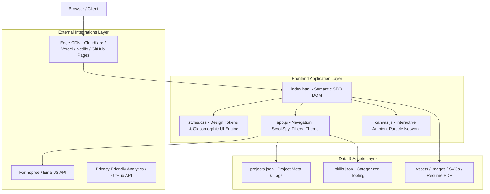
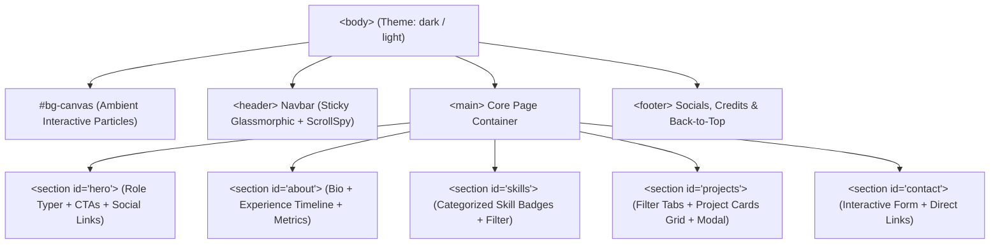
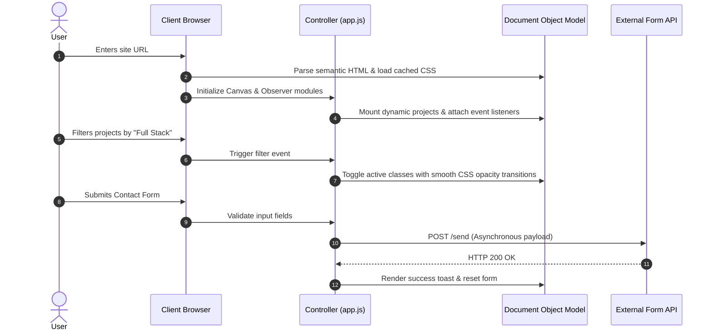
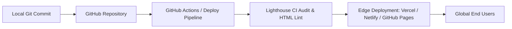

# System Architecture & Technical Design Document

**Project:** Modern Developer & Engineering Portfolio  
**Status:** Approved  
**Version:** 1.0.0  
**Target Architecture:** Static Jamstack / Client-Side SPA with Componentized Design Tokens & Micro-Interactions  

---

## 1. High-Level Architecture Overview

The portfolio is designed following a **lightweight, zero-overhead Jamstack architecture**. It delivers sub-second initial load times, maximum SEO indexability, 60fps canvas micro-interactions, and modular maintainability without heavy framework lock-in.



---

## 2. Component Hierarchy & DOM Structure

The application employs semantic HTML5 elements structured cleanly for accessibility (ARIA) and search engine crawler readability.



---

## 3. Directory Structure

```text
portfolio/
├── PRD.md                     # Product Requirements Document
├── architecture.md            # System Architecture & Technical Design (this file)
├── index.html                 # Root semantic HTML entrypoint
├── css/
│   ├── variables.css          # Color tokens, typography scales, glassmorphism variables
│   ├── base.css               # Reset, typography, utility classes
│   ├── components/
│   │   ├── navbar.css         # Glassmorphic header & mobile drawer
│   │   ├── hero.css           # Hero animations, badge styles
│   │   ├── timeline.css       # Experience & education timeline
│   │   ├── cards.css          # Project cards, skill pills, hover spotlights
│   │   ├── modal.css          # Project details modal / drawer
│   │   └── form.css           # Contact form inputs & state feedback
│   └── styles.css             # Main stylesheet orchestrator
├── js/
│   ├── app.js                 # App initialization & core UI controllers
│   ├── canvas.js              # Ambient interactive particle mesh system
│   ├── scroll-spy.js          # IntersectionObserver-based active link indicator
│   ├── project-filter.js      # Dynamic tag filtering & modal renderer
│   ├── typewriter.js          # Dynamic role text typing animation
│   └── contact.js             # Form validation & asynchronous submission
└── assets/
    ├── icons/                 # Inline SVGs for tech stack & socials
    ├── images/                # Optimized project preview screenshots (WebP/AVIF)
    └── resume.pdf             # Downloadable resume
```

---

## 4. Subsystems & Module Breakdown

### 4.1. Visual & Rendering Engine (CSS & Canvas)
* **Design Token System (`variables.css`):**
  * HSL tailored palette with dark mode as primary (`#0B0F17` background, `#38BDF8` electric cyan, `#6366F1` indigo).
  * Layered backdrop-filter blurs (`12px` to `20px`) with border highlights (`rgba(255, 255, 255, 0.08)`).
* **Ambient Canvas Layer (`canvas.js`):**
  * Hardware-accelerated 2D canvas context.
  * Node network with distance-based connective line drawing.
  * Interactive mouse repulsion/gravitational field with `requestAnimationFrame` loop.
  * Auto-throttling on low-power devices and inactive tabs (`visibilitychange` listener).

### 4.2. State & Interaction Controllers (JavaScript)
* **Theme Management:**
  * Persistent theme state in `localStorage` with `prefers-color-scheme` fallback.
* **Scroll-Spy & Reveal Orchestrator (`scroll-spy.js`):**
  * Employs native `IntersectionObserver` instead of heavy scroll event listeners.
  * Staggered fade-in-up animations applied via `data-reveal` attributes.
* **Project Filtering & Modal Controller (`project-filter.js`):**
  * Client-side tag filtering without full page re-renders.
  * Accessible modal dialog with focus trap and `Escape` key listeners.
* **Form Submission Pipeline (`contact.js`):**
  * Asynchronous `fetch()` submission to serverless endpoint (Formspree / Web3Forms).
  * Input sanitization, regex email validation, and inline toast feedback.

---

## 5. Data Flow & Communication



---

## 6. Performance, Security & SEO Engineering

### 6.1. Performance Strategies
* **Critical CSS Inlining:** Fast above-the-fold render for instant First Contentful Paint (<0.8s).
* **Asset Optimization:** WebP image formats with `loading="lazy"` and explicit `width`/`height` attributes to prevent Cumulative Layout Shift (CLS).
* **Font Optimization:** Preloaded Google Fonts (`Inter`, `Space Grotesk`, `JetBrains Mono`) with `font-display: swap`.

### 6.2. Security Architecture
* **Content Security Policy (CSP):** Strict script sources and disallowed inline unsafe evaluations.
* **Client-Side Form Sanitization:** Stripping malicious HTML tags before dispatch.
* **Zero Secrets in Repository:** Public keys only; all emails routed through external secure webhook endpoints.

### 6.3. SEO & OpenGraph Matrix
* Fully populated JSON-LD Schema (`Person` and `WebSite` types).
* Meta tags for Twitter Cards (`summary_large_image`) and OpenGraph protocols.
* Proper canonical URLs and sitemap generation.

---

## 7. Deployment & CI/CD Pipeline


